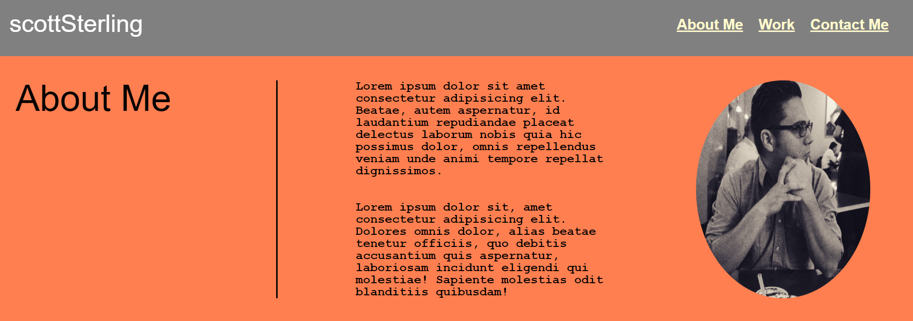
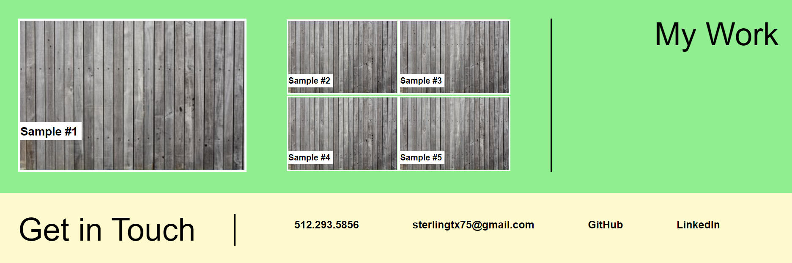
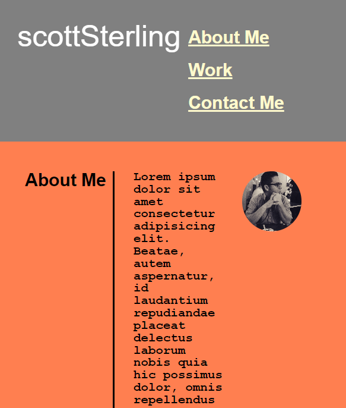
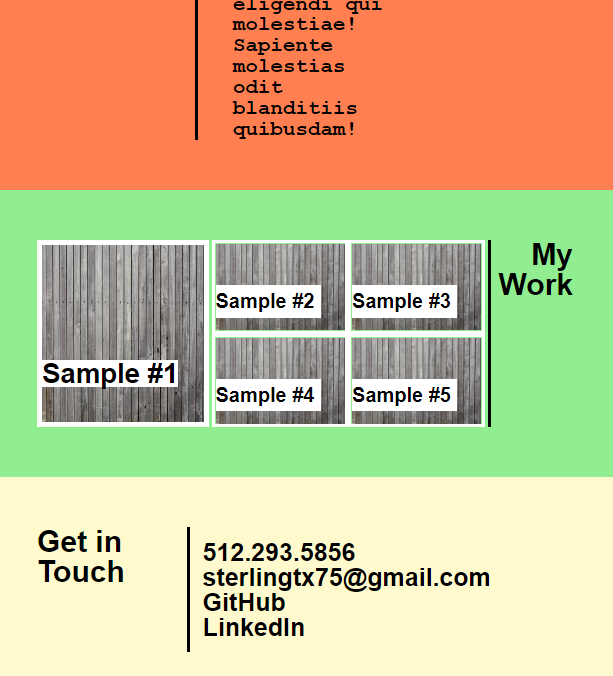

# Robert (Scott) Sterling - Professional Portfolio

## Description

My portfolio is a 4-level page with a navigation bar and a main body that utilizes a left-right-left design:
(1) The navigation bar include my name in camel-case, in addition to three links on the right that, if clicked, jump down to the appropriate section. The links have a color-changing hover effect.
(2) The About Me section includes a title that is separated by a right border from some placeholder lorem text, as well as an oval-shaped image of myself.
(3) The My Work section includes a title that is separated by a left border from two subsections of placeholder images that will eventually become real samples of my future projects. The first subsection will be the primary (and strongest) project, while the second subsection contains a grid comprising four more future projects. Each item is labeled with an item number.
(4) Finally, the Get in Touch section includes a title that is separated by a right border from links that indicate four different ways to contact me. The links display a dashed border effect when hovered over. (Clicking on the phone number simply takes you back to the top of the page.)

There is a responsive design aspect that allows the user to view my portfolio on various screen sizes. As the screen is made more narrow, items will begin to stack and become smaller.

### Motivation

The inspiration for this layout came from one of the examples that I found of other portfolios online, although mine is a very scaled-down version. For my first attempt at a portfolio, I wanted to create something simple and doable that would line up with my skill level but that I can fine tune and add to, as my repertoire increases in size and skill.

#### Screenshots

